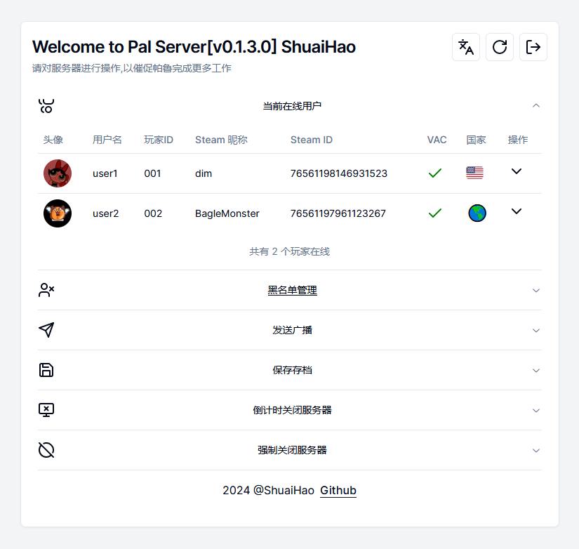

# PalPanel

PalPanel 是基于Next.js实现的帕鲁服务器管理面板。通过RCON协议，管理员可以轻松管理服务器，执行各种操作，包括用户管理、黑名单维护、存档保存等功能。

## 特性

- **在线用户管理**：查看当前在线用户，执行封禁或踢出操作。
- **可视化Steam信息**：查看在线用户的Steam账户信息。
- **黑名单管理**：轻松添加或移除黑名单条目。
- **实时banlist.txt生成**：实时生成封禁名单文件,可结合帕鲁服务器配置远程banlist.txt
- **游戏广播**：向所有玩家发送游戏内广播消息。
- **游戏存档保存**：备份游戏存档，确保游戏数据安全。
- **关闭服务器**：当需要时，可以安全地关闭游戏服务器。

## 安装

目前，PalPanel 的安装说明尚未提供。请保持关注，将在后续更新中提供详细的安装和配置指南。

## 使用说明

使用PalPanel之前，您需要确保您的游戏服务器已启用RCON协议。配置好PalPanel面板后，您可以执行以下操作：

1. 查看在线用户：在PalPanel中，您可以看到所有在线玩家的列表，并进行管理。
2. 管理黑名单：通过简单的界面添加或移除用户到黑名单。
3. 发送游戏广播：使用广播功能，您可以发送消息到游戏中，通知或者提醒玩家。
4. 保存游戏存档：定期或在必要时手动保存游戏存档。
5. 关闭服务器：在维护或更新游戏时，您可能需要关闭服务器，PalPanel提供了这一功能。

## 多语言支持

本项目支持国际化（i18n），可以轻松适配多种语言环境，确保不同语言的用户都能使用PalPanel进行服务器管理。

欢迎将 [locales/](https://github.com/shuaihaoV/PalPanel/tree/main/locales/) 中的json文件翻译成你的语言，并提出PR请求。

## 贡献

如果您想为PalPanel贡献代码或提供反馈，请遵循以下步骤：

1. Fork 项目仓库。
2. 创建您的特性分支 (`git checkout -b feature/AmazingFeature`)。
3. 提交您的更改 (`git commit -m 'Add some AmazingFeature'`)。
4. 将您的更改推送到分支 (`git push origin feature/AmazingFeature`)。
5. 打开一个Pull Request。

## 支持

如果您在使用PalPanel时遇到问题或需要帮助，请通过以下方式联系我们：

- 在本项目的 [Issues](https://github.com/shuaihaoV/PalPanel/issues) 页面提交问题

## 项目依赖

- [Next.js](https://nextjs.org/) - 用于构建应用程序的React框架。
- [radix-ui](https://radix-ui.com/) - 用于构建UI的React组件库。

## 致谢

- 参考了[Bluefissure/pal-conf](https://github.com/Bluefissure/pal-conf/tree/main)项目的部分前端实现