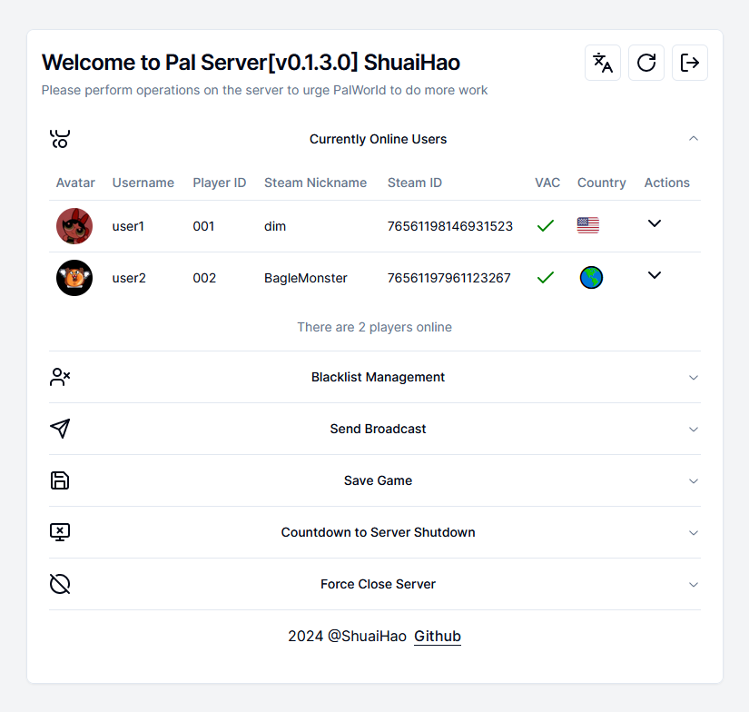

<div align="center">
<h1 align="center">PalPanel</h1>
[简体中文](./README_EN.md) /English

PalPanel is a PalWorld server management panel based on Next.js. Administrators can easily manage the server through the RCON protocol, performing various operations including user management, blacklist maintenance, and archive preservation.


</div>

## Features

- **Online User Management**: View current online users and perform banning or kicking operations.
- **Visual Steam Information**: View online users' Steam account information.
- **Blacklist Management**: Easily add or remove blacklist entries.
- **Real-time banlist.txt Generation**: Real-time generation of the ban list file, which can be combined with the PalWorld server's remote banlist.txt configuration.
- **Game Broadcasting**: Send in-game broadcast messages to all players.
- **Game Archive Preservation**: Backup game archives to ensure game data safety.
- **Server Shutdown**: Safely shut down the game server when needed.

## Usage Instructions

Before using PalPanel, ensure that your game server has enabled the RCON protocol. Once the PalPanel panel is configured, you can perform the following operations:

1. View Online Users: In PalPanel, you can see a list of all online players and manage them.
2. Manage Blacklist: Add or remove users to the blacklist through a simple interface.
3. Send Game Broadcasts: Use the broadcast feature to send messages to the game, notifying or reminding players.
4. Save Game Archives: Regularly or manually save game archives when necessary.
5. Shut Down the Server: When maintaining or updating the game, you may need to shut down the server, and PalPanel provides this functionality.



## Environment Variables

> The PalPanel project requires certain environment variables to function properly.
>
> Please ensure that these environment variables are set before deployment or local development.

- `RCON_HOST`: The hostname or IP address of the RCON server.
- `RCON_PORT`: The port number of the RCON server.
- `RCON_PASSWORD`: The password of the RCON server.
- `AUTH_SECRET`: A key used for authentication, generated using `openssl rand -base64 32`.
- `WEB_USERNAME`: The username of the website administrator (in plain text).
- `WEB_PASSWORD`: The `SHA256` hash value of the website administrator's password, which can be generated online using [SHA256 Generator](https://tools.keycdn.com/sha256-online-generator).
- `STEAM_API_KEY`: The secret key for the Steam API, obtained from the [Steam official website](https://steamcommunity.com/dev/apikey).
  Add these environment variables to your project. You can use a .env file or the configuration interface of the deployment platform to set these variables.

## Build Guide

This comprehensive guide will help you build and deploy PalPanel. Choose the method that best suits your needs.

### Prerequisites

Before building PalPanel, ensure you have the following software installed:

#### For Local Development:
- **Node.js** (version 18 or higher): [Download Node.js](https://nodejs.org/)
- **Yarn** package manager: [Install Yarn](https://yarnpkg.com/getting-started/install)
- **Git**: [Download Git](https://git-scm.com/downloads)

#### For Docker Deployment:
- **Docker**: [Install Docker](https://docs.docker.com/get-docker/)
- **Docker Compose** (optional): [Install Docker Compose](https://docs.docker.com/compose/install/)

### Method 1: Local Development Setup

Perfect for development, testing, or running PalPanel without Docker.

#### Step 1: Clone the Repository
```bash
# Clone the repository
git clone https://github.com/shuaihaoV/PalPanel.git
cd PalPanel
```

#### Step 2: Install Dependencies
```bash
# Install project dependencies
yarn install
```

#### Step 3: Configure Environment Variables
```bash
# Copy the environment template
cp .env .env.local

# Edit the environment file with your settings
# On Windows: notepad .env.local
# On Linux/macOS: nano .env.local
```

Set the following variables in `.env.local`:
```env
RCON_HOST=your-palworld-server-ip
RCON_PORT=25575
RCON_PASSWORD=your-rcon-password
AUTH_SECRET=your-generated-secret
WEB_USERNAME=admin
WEB_PASSWORD=your-hashed-password
STEAM_API_KEY=your-steam-api-key
```

#### Step 4: Generate Required Secrets
```bash
# Generate AUTH_SECRET (copy the output to your .env.local file)
openssl rand -base64 32

# Generate WEB_PASSWORD hash (replace "your-password" with your desired password)
echo -n "your-password" | sha256sum | awk '{print $1}'
```

#### Step 5: Run Development Server
```bash
# Start the development server
yarn dev
```

The application will be available at `http://localhost:3000`

#### Step 6: Build for Production (Optional)
```bash
# Build the application for production
yarn build

# Start the production server
yarn start
```

### Method 2: Building from Source with Docker

Build your own Docker image from the source code.

#### Step 1: Clone and Build
```bash
# Clone the repository
git clone https://github.com/shuaihaoV/PalPanel.git
cd PalPanel

# Build the Docker image
docker build -t palpanel:custom .
```

#### Step 2: Run Your Custom Image
```bash
# Generate required secrets
AUTH_SECRET=$(openssl rand -base64 32)
WEB_PASSWORD=$(echo -n "your-password" | sha256sum | awk '{print $1}')

# Run the container
docker run -d \
  --name PalPanel \
  -p 3000:3000 \
  -e RCON_HOST=your-palworld-server-ip \
  -e RCON_PORT=25575 \
  -e RCON_PASSWORD=your-rcon-password \
  -e AUTH_SECRET=$AUTH_SECRET \
  -e WEB_USERNAME=admin \
  -e WEB_PASSWORD=$WEB_PASSWORD \
  -e STEAM_API_KEY=your-steam-api-key \
  palpanel:custom
```

## Deployment Guide

### 1. Docker Deployment (Recommended)

```bash
# Generate AUTH_SECRET
AUTH_SECRET=`openssl rand -base64 32`
WEB_PASSWORD=`echo -n "password" | sha256sum | awk '{print $1}'`
# Docker start
docker run -d \
  --name PalPanel \
  -p 80:3000 \
  -e RCON_HOST=RCON server domain or IP \
  -e RCON_PORT=RCON server port \
  -e RCON_PASSWORD=RCON connection password \
  -e AUTH_SECRET=$AUTH_SECRET\
  -e WEB_USERNAME=panel username \
  -e WEB_PASSWORD=$WEB_PASSWORD \
  -e STEAM_API_KEY=Steam key \
  shuaihaov/palpanel:latest
```

### 2. Docker Compose Deployment

```bash
mkdir palpanel && cd palpanel
wget https://github.com/shuaihaoV/PalPanel/raw/main/docker-compose.yml
wget https://raw.githubusercontent.com/shuaihaoV/PalPanel/main/.env

# Modify .env
vim .env

# docker compose start
docker compose up -d
# For some versions, use docker-compose up -d
```

### Troubleshooting

#### Common Issues and Solutions

**Issue: "AUTH_SECRET is required"**
```bash
# Generate a new AUTH_SECRET
openssl rand -base64 32
```

**Issue: "Connection refused" or RCON errors**
- Verify your PalWorld server has RCON enabled
- Check that RCON_HOST and RCON_PORT are correct
- Ensure RCON_PASSWORD matches your server configuration
- Verify firewall settings allow connections to the RCON port

**Issue: "Invalid credentials" when logging in**
```bash
# Regenerate password hash
echo -n "your-actual-password" | sha256sum | awk '{print $1}'
```

**Issue: Docker build fails with network errors**
- This can happen in restricted environments
- Try pulling the pre-built image instead: `docker pull shuaihaov/palpanel:latest`

**Issue: "Permission denied" errors**
```bash
# On Linux/macOS, you might need to run Docker commands with sudo
sudo docker run ...
```

**Issue: Port 3000 already in use**
```bash
# Use a different port
docker run -p 8080:3000 ...
# Then access via http://localhost:8080
```

**Issue: Environment variables not loading**
- Ensure `.env` file is in the same directory as docker-compose.yml
- Check that variable names match exactly (case-sensitive)
- Restart the container after changing environment variables

#### Getting Help

If you encounter issues not covered here:
1. Check the [Issues](https://github.com/shuaihaoV/PalPanel/issues) page for similar problems
2. Enable debug logging by setting `NODE_ENV=development`
3. Check Docker logs: `docker logs PalPanel`

## Multi-Language Support

This project supports internationalization (i18n) and can easily adapt to various language environments, ensuring that users of different languages can use PalPanel for server management.

Feel free to translate the json files in [locales/](https://github.com/shuaihaoV/PalPanel/tree/main/locales/) into your language and submit a pull request.

## Contributing

If you would like to contribute code or provide feedback for PalPanel, please follow these steps:

1. Fork the project repository.
2. Create your feature branch (`git checkout -b feature/AmazingFeature`).
3. Commit your changes (`git commit -m 'Add some AmazingFeature'`).
4. Push your changes to the branch (`git push origin feature/AmazingFeature`).
5. Open a Pull Request.

## Support

If you encounter issues or need assistance while using PalPanel, please contact us through the following methods:

- Submit issues on this project's [Issues](https://github.com/shuaihaoV/PalPanel/issues) page

## Project Dependencies

- [Next.js](https://nextjs.org/): A React framework for building applications.
- [radix-ui](https://radix-ui.com/): A React component library for building UI.

## Acknowledgments

- Borrowed some frontend implementation from the [Bluefissure/pal-conf](https://github.com/Bluefissure/pal-conf/tree/main) project.

